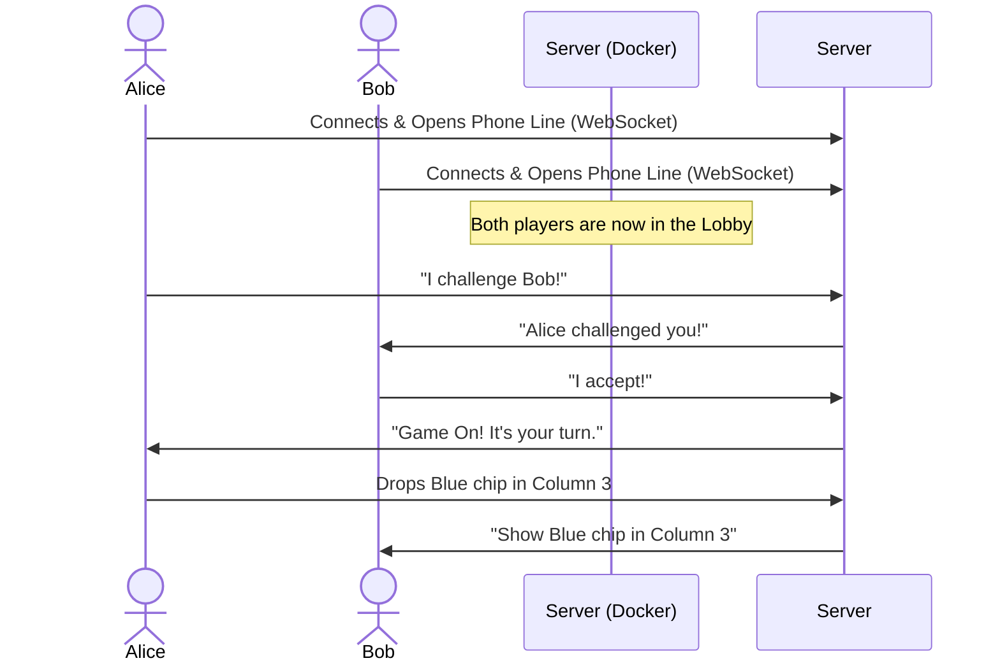

# Multiplayer Connect 4 🎮

Welcome to the **Multiplayer Connect 4** game! This project is a complete, real-time online game that you can run on your own computer or server. 

We've designed this so that **anyone** can understand how it works, even if you aren't a seasoned software engineer. Below, you'll find easy-to-understand explanations, analogies, and diagrams explaining how everything connects together.

---

## 🧩 The Big Picture: How Does it Work?

Imagine you want to open a new pizza restaurant (your game), but you don't want the hassle of building the kitchen, the dining area, and the plumbing from scratch every single time you move locations. 

Instead, you build your entire restaurant inside a **magic shipping container**. No matter where you place this container—in your backyard, on a cloud server, or in a data center—you just plug in one power cord, and the restaurant is immediately open for business.

### The Magic Container (Docker) 🐳
In our setup, **Docker** is that magic shipping container. It packs our entire game (the "Kitchen" making the rules, and the "Dining Area" where users play) into one single box. 
- **The Dining Area (React Frontend):** This is the beautiful visual menu and the physical Connect 4 board that players interact with. It's built with tools called React and TailwindCSS.
- **The Kitchen (FastAPI Backend):** This is the brain of the operation. It makes sure players follow the rules, determines who wins, and stores player records (like a restaurant's ledger).

---

## 📡 How Do Players Talk to Each Other? (WebSockets)

Normally, when you browse a website (like reading a news article), your browser asks the server, "Hey, can I have the article?" The server hands it over, and then the server **hangs up the phone**. If the article updates, you have to hit "Refresh" to call the server again.

If we built a game like this, you'd have to hit "Refresh" to see if your opponent made a move! That would be terrible.

Instead, we use **WebSockets**. 
A WebSocket is like **keeping the phone line open**. When Alice and Bob join the game, their computers call the server, and the server *doesn't hang up*. 
- When Alice drops a blue chip, her computer immediately whispers through the open phone line: *"Alice played in Column 3."*
- The server instantly whispers to Bob: *"Hey, Alice played Column 3, update your screen!"*

### The Real-Time Network Flow


*(Note: If your Markdown viewer supports Mermaid diagrams, you will see a visual flowchart above!)*

---

## 🌍 How Do People on the Internet Find It? (Cloudflare Tunnels)

So your Magic Container (Docker) is running on your server in your house. But how do players across the world connect to it safely without you having to punch dangerous holes in your home's internet router?

We use a **Cloudflare Tunnel**. 
Imagine your house (your server) has no doors or windows—it is completely secure from the outside world. But, you dig a secret, secure underground tunnel that goes straight from your server all the way to a highly protected castle (Cloudflare). 

When someone types `www.surfingshow.com` into their browser, they go to the Cloudflare Castle. Cloudflare then safely escorts them through the secret underground tunnel straight into your Magic Container.

### The Architecture Map
```text
[Player A] \                                              /-> [React UI (Visuals)]
            \                                            /
             -> [Cloudflare Castle] ====(Tunnel)====> [Docker Container (Port 8777)]
            /   (www.surfingshow.com)                    \
[Player B] /                                              \-> [FastAPI (Game Brain)] <--> [SQLite Database]
```

---

## 🚀 Getting Started (How to run it yourself)

### Prerequisites
You only need two tools installed on your computer:
1. **Docker:** The tool that runs the "Magic Containers".
2. **Docker Compose:** A tool that reads our instruction manual (`docker-compose.yml`) to start the container perfectly every time.

### Starting the Game Locally
1. Download this code to your computer (clone the repository).
2. Open your computer's terminal (or command prompt) and go to the folder where you downloaded the code.
3. Tell Docker to start the container by typing:
   ```bash
   docker-compose up -d
   ```
4. Open your web browser and go to `http://localhost:8777`. You're playing!

*(The game saves player scores in a folder called `./data`. Because it's mapped outside the container, your leaderboard won't erase if you turn your computer off.)*

---

## 🌐 Production Setup (Cloudflare Tunnels)

If you have a server (like a Linux machine) and want to attach this game to your own domain name (like `www.surfingshow.com`), follow these steps:

1. **Install Cloudflared:** This is the tool that digs the secret underground tunnel.
2. **Login to Cloudflare:**
   ```bash
   cloudflared tunnel login
   ```
3. **Create the Tunnel:** Give your tunnel a name (like `connect4-tunnel`).
   ```bash
   cloudflared tunnel create connect4-tunnel
   ```
4. **Give the Tunnel Directions:** Create a configuration file at `~/.cloudflared/config.yml` that tells the tunnel to connect incoming visitors to your Docker container on port 8777:
   ```yaml
   tunnel: <your-tunnel-id>
   credentials-file: /root/.cloudflared/<your-tunnel-id>.json

   ingress:
     - hostname: www.surfingshow.com
       service: http://localhost:8777
     - service: http_status:404
   ```
5. **Attach the Domain:** Tell Cloudflare that `www.surfingshow.com` belongs to this tunnel.
   ```bash
   cloudflared tunnel route dns connect4-tunnel www.surfingshow.com
   ```
6. **Start the Tunnel!**
   ```bash
   cloudflared tunnel run connect4-tunnel
   ```

And that's it! You now have a fully functioning, real-time multiplayer game hosted on the internet safely and securely. Have fun playing Connect 4!
